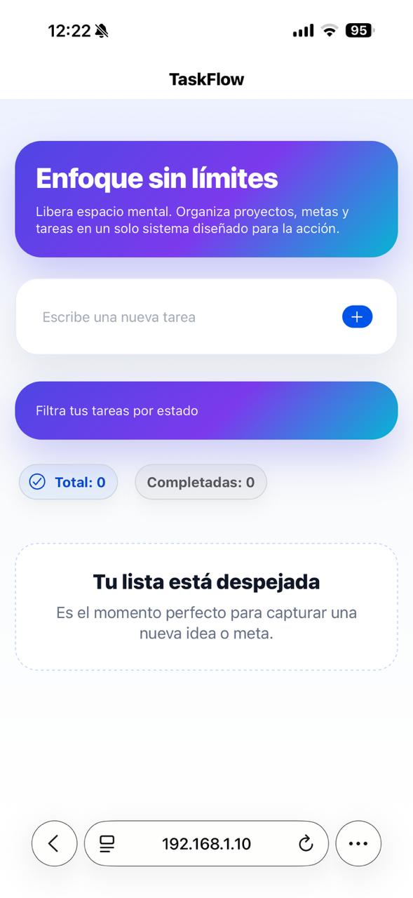
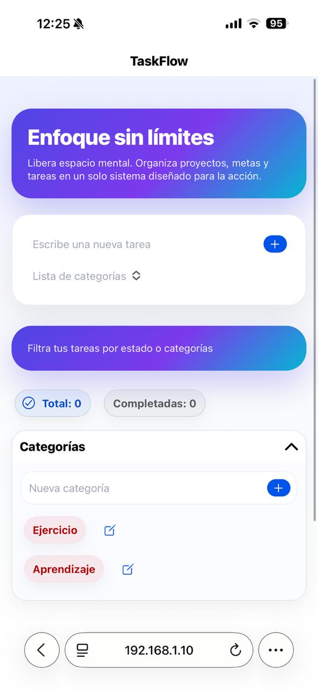
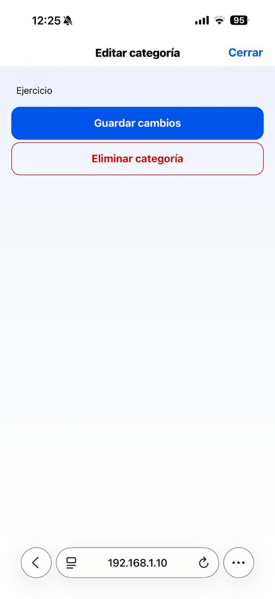
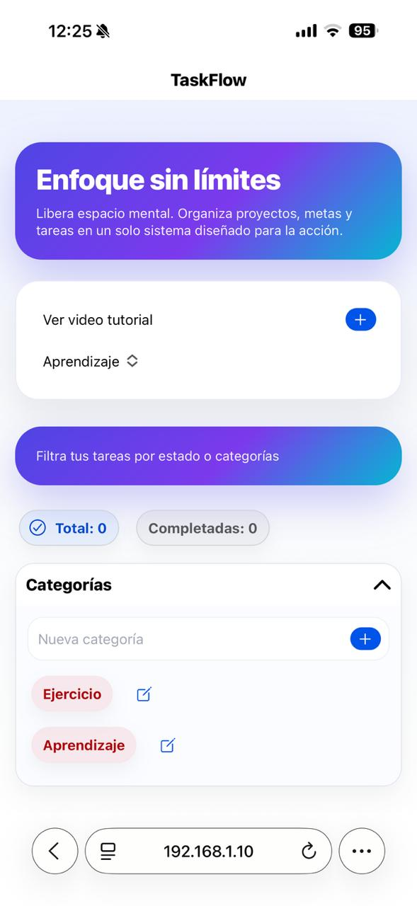
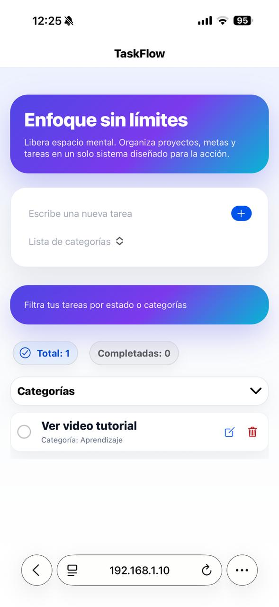

# TaskFlow

Aplicación híbrida desarrollada con **Ionic + Angular + Cordova**, orientada a la gestión de tareas con categorías, filtros dinámicos y control de funcionalidades mediante **feature flags (Firebase Remote Config)**.

## Descripción

TaskFlow permite a los usuarios gestionar sus tareas de forma eficiente, ofreciendo:

- Creación y eliminación de tareas
- Edición de tareas: cambio de nombre, cambio o eliminación de categoría asociada
- Marcar tareas como completadas
- Filtros por estado (total / completadas)
- Filtros por categoría (habilitados dinámicamente)
- Gestión completa de categorías(creación, edición y eliminación)
- Control de funcionalidades mediante configuración remota (feature flags)

---

## Entorno de desarrollo
El proyecto fue desarrollado con versiones recientes de las siguientes tecnologías. 
Se recomienda utilizar versiones iguales o superiores, asegurando compatibilidad con Angular 16:

- Node.js: 24.15.0
- npm: 11.12.1
- Ionic CLI: 7.2.1
- Angular: 20.0.0
- Cordova: 13.0.0
- Java JDK: 21.0.8
- Android SDK (API 36)
- Gradle: 9.4.1 

## Instalación
Instalación de herramientas globales:
- npm install -g @ionic/cli cordova

Clonar repositorio

La rama `main` contiene la versión final y estable de la aplicación.
- git clone https://github.com/mimuriel/taskboard-app.git
- cd taskboard-app

Instalar dependencias
- npm install

## Configuración de Firebase
El proyecto utiliza Firebase Remote Config para controlar dinámicamente funcionalidades.

Archivo de configuración:
- src/environments/firebase.config.ts
```bash
export const firebaseConfig = {
  apiKey: "",
  authDomain: "",
  projectId: "",
  storageBucket: "",
  messagingSenderId: "",
  appId: "",
  measurementId: ""
};
```
## Feature Flags (Remote Config)
Se implementa la bandera:
- isCategoriesEnabled
  
| Valor | Resultado |
|----------|------------------|
| True | Habilita categorías y filtros por categoría |
| False | Oculta completamente la funcionalidad de categorías |

## Ejecución del Proyecto

Ejecutar en entorno local navegador
- ionic serve
  
Aplicación disponible en: 
- http://localhost:8100

Prueba en Dispositivo Móvil

Para probar en un dispositivo dentro de la misma red:
- ionic serve --external
  
Abrir en el navegador del dispositivo: 
- http://<IP_LOCAL>:8100

## Compilación Android (APK)
- ionic cordova build android
  
APK generado en:
- platforms\android\app\build\outputs\apk\debug\app-debug.apk

## Compilación iOS (IPA)
Requisitos:
- macOS + Xcode + cuenta Apple Developer

comandos
- ionic cordova platform add ios
- ionic cordova build ios

Nota importante: La generación del archivo .ipa no se realizó debido a limitaciones del entorno (Windows). Sin embargo, el proyecto está configurado para su compilación en macOS.

## Decisiones técnicas
- Arquitectura basada en NgModule.
- Separación de responsabilidades mediante servicios.
- Uso de observables para el manejo reactivo de tareas y categorías.
- Persistencia local de tareas y categorías.
- Control dinámico de funcionalidades mediante Firebase Remote Config.
- Configuración preparada para compilación híbrida con Cordova.

## Estructura del proyecto
```text
src/app/
  core/
    services/        Servicios principales de la aplicación
  shared/
    models/          Modelos de datos
  home/              Módulo principal de tareas
  app.module.ts      Módulo raíz de la aplicación
  app-routing.module.ts Rutas principales
```

## 📸 Vista de la aplicación
### Pantalla principal
<p align="center">
  
</p>

### Gestión de categorías
<p align="center">


</p>

### Gestión de tareas
<p align="center">


</p>
